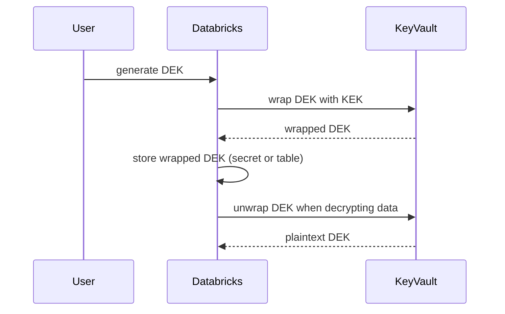
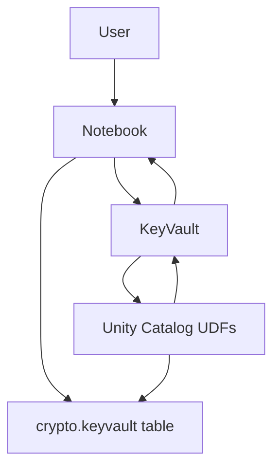

# Envelope Encryption v2

This folder contains an example implementation of envelope encryption inside Databricks.
Two approaches are provided:

* **secrets_manager** – uses AWS Secrets Manager to store a key encryption key (KEK) and encrypted data encryption keys (DEKs).
* **kms** – uses AWS Key Management Service (KMS) and a Unity Catalog table to manage encrypted DEKs.

Each approach provides notebooks that demonstrate how to generate keys, encrypt sensitive columns and allow controlled decryption via SQL functions.

## Adapting the approach for Azure Key Vault

The same pattern can be implemented with Azure Key Vault. A sample helper module is provided in `common/azure_crypto_functions.py` which uses `azure-identity` and `azure-keyvault` packages.

Example usage:

```python
from azure.identity import DefaultAzureCredential
from notebooks.envelope_encryption_v2.common import azure_crypto_functions as az_crypto

credential = DefaultAzureCredential()
key_vault_url = "https://<your-vault>.vault.azure.net/"
key_name = "uc-demo-kek"

# create or fetch KEK
ez_crypto.create_keyvault_key(key_vault_url, key_name, credential)

# generate a DEK locally and wrap it with the KEK
import os
plain_dek = os.urandom(32)
wrapped_dek = az_crypto.wrap_data_key(key_vault_url, key_name, plain_dek, credential)

# later unwrap
unwrapped_dek = az_crypto.unwrap_data_key(key_vault_url, key_name, wrapped_dek, credential)
```

## Sequence diagram



The wrapped DEK can be stored in an Azure Key Vault secret or a Unity Catalog table similarly to the AWS examples. SQL UDFs can call Python functions that use a service principal to unwrap the DEK when decrypting sensitive columns.

## Azure example notebooks

The `azure_key_vault` directory provides Databricks notebooks that mirror the AWS
flows using Azure Key Vault. The notebooks include:

* `01_setup.ipynb` – create or fetch the KEK in Azure Key Vault.
* `02_user.ipynb` – example of wrapping and unwrapping a DEK using the KEK.
* `03_new_dek.ipynb` – demonstrates generating a new DEK.

## Architecture diagram



### Detailed Azure setup

1. Run `azure_key_vault/01_setup.ipynb` to create the KEK, store the wrapped DEK in the `crypto.keyvault` table and create the `unwrap_key`, `encrypt` and `decrypt` SQL functions.
2. Use `crypto.encrypt` when writing sensitive columns so that the plaintext never leaves the notebook context.
3. Only members of `<catalog>.<schema>.crypto.user` are able to call `crypto.decrypt` which unwraps the DEK via Azure Key Vault.
